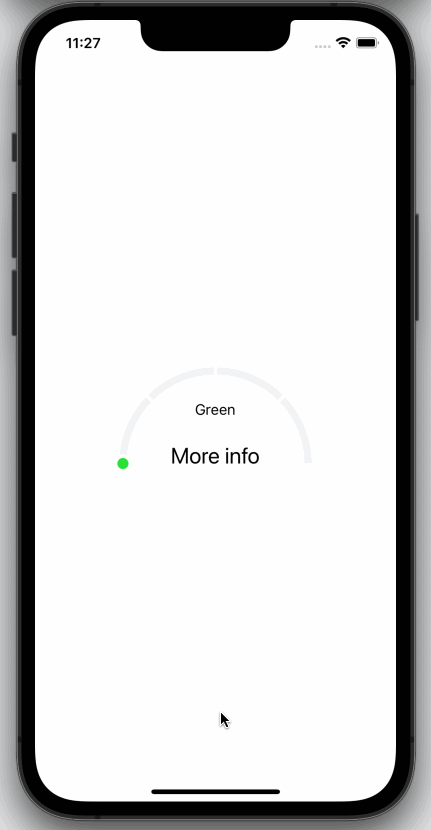

# Segmented Arc for React Native

Segmented arc component for React Native. Check out our documentation below to learn how to get started.

## Example app demo



## Table of Contents

- [Installation](#-installation)
- [Usage](#-usage)
- [Props](#-props)
- [Attributions](#-attributions)
- [Contributing](#-contributing)
- [Maintainers](#-maintainers)
- [Versioning](#-versioning)
- [License](#-license)
- [Notice](#-notice)
- [Security](#-security)

## 🚀 Installation

There are two steps to get this package up and running.

1. Install `react-native-svg` library by following their [instructions.](https://github.com/react-native-svg/react-native-svg)

2. Install `@shipt/segmented-arc-for-react-native`:

```bash
yarn add @shipt/segmented-arc-for-react-native
```

or if you prefer to use npm:

```bash
npm install --save @shipt/segmented-arc-for-react-native
```

## 🎉 Usage

Here is a basic example of how to use this component. It covers all the main features.

```js
import React, { useState } from 'react';
import { View, Text, Pressable } from 'react-native';
import { SegmentedArc } from '@shipt/segmented-arc-for-react-native';

const App = () => {
  const [showArcRanges, setShowArcRanges] = useState(false);

  const segments = [
    {
      scale: 0.25,
      filledColor: '#FF746E',
      emptyColor: '#F2F3F5',
      data: { label: 'Red' }
    },
    {
      scale: 0.25,
      filledColor: '#F5E478',
      emptyColor: '#F2F3F5',
      data: { label: 'Yellow' }
    },
    {
      scale: 0.25,
      filledColor: '#78F5CA',
      emptyColor: '#F2F3F5',
      data: { label: 'Green' }
    },
    {
      scale: 0.25,
      filledColor: '#6E73FF',
      emptyColor: '#F2F3F5',
      data: { label: 'Blue' }
    }
  ];

  const ranges = ['10', '20', '30', '40', '50'];

  const _handlePress = () => {
    setShowArcRanges(!showArcRanges);
  };

  return (
    <View style={{ flex: 1, alignItems: 'center', justifyContent: 'center' }}>
      <SegmentedArc
        segments={segments}
        fillValue={70}
        isAnimated={true}
        animationDelay={1000}
        showArcRanges={showArcRanges}
        ranges={ranges}
      >
        {metaData => (
          <Pressable onPress={_handlePress} style={{ alignItems: 'center' }}>
            <Text style={{ fontSize: 16, paddingTop: 16 }}>{metaData.lastFilledSegment.data.label}</Text>
            <Text style={{ lineHeight: 80, fontSize: 24 }}>More info</Text>
          </Pressable>
        )}
      </SegmentedArc>
    </View>
  );
};

export default App;
```

Try this example yourself [here](./example).

# 📖 Props

| Name                        | Type                                                                              | Default          | Description                                                                                                                                                                                                                                                                          |
| --------------------------- | --------------------------------------------------------------------------------- | ---------------- | ------------------------------------------------------------------------------------------------------------------------------------------------------------------------------------------------------------------------------------------------------------------------------------ |
| fillValue                   | number (0-100)                                                                    | 0                | Current progress value                                                                                                                                                                                                                                                               |
| segments                    | Array of { scale: number, filledColor: string, emptyColor: string, data: object } | []               | Segments of the arc. Here, scale is a percentage value out of 100%, filledColor for filled part of a segment, and emptyColor is background color for an empty segment, data could be any object that you'd want to receive back for a segment. See example above.                    |
| filledArcWidth              | number                                                                            | 8                | Thickness of progress line                                                                                                                                                                                                                                                           |
| emptyArcWidth               | number                                                                            | 8                | Thickness of background line                                                                                                                                                                                                                                                         |
| spaceBetweenSegments        | number                                                                            | 2                | Space between segments                                                                                                                                                                                                                                                               |
| arcDegree                   | number                                                                            | 180              | Degree of arc                                                                                                                                                                                                                                                                        |
| radius                      | number                                                                            | 100              | Arc radius                                                                                                                                                                                                                                                                           |
| isAnimated                  | bool                                                                              | true             | Enable/disable progress animation                                                                                                                                                                                                                                                    |
| animationDuration           | number                                                                            | 1000             | Progress animation duration                                                                                                                                                                                                                                                          |
| animationDelay              | number                                                                            | 0                | Progress animation delay                                                                                                                                                                                                                                                             |
| ranges                      | Array of strings                                                                  | []               | Arc ranges (segments) display values                                                                                                                                                                                                                                                 |
| rangesTextColor             | string                                                                            | '#000000'        | Color of ranges text                                                                                                                                                                                                                                                                 |
| rangesTextStyle             | object                                                                            | { fontSize: 12 } | Ranges text styling                                                                                                                                                                                                                                                                  |
| showArcRanges               | bool                                                                              | false            | Show/hide arc ranges                                                                                                                                                                                                                                                                 |
| middleContentContainerStyle | object                                                                            | {}               | Extra styling for the middle content container                                                                                                                                                                                                                                       |
| capInnerColor               | string                                                                            | '#28E037'        | Cap's inner color                                                                                                                                                                                                                                                                    |
| capOuterColor               | string                                                                            | '#FFFFFF'        | Cap's outer color                                                                                                                                                                                                                                                                    |
| children                    | function                                                                          |                  | Pass a function as a child. It receives metaData with the last filled segment's data as an argument. From there you can extract data object. See example above.                                                                                                                      |
| alignRangesWithSegments     | bool                                                                              | false            | This might be useful when using segment[].arcDegreeScale values to customize the size of individual segments. If you'd like the range display to align with the edge of each segment, pass this prop as `true`. Otherwise, range displays will be distributed evenly across the arc. |

## 📋 Attributions

Read the Attributions [here](ATTRIBUTIONS.md).

## 👏 Contributing

Please read our [CONTRIBUTING.md](./CONTRIBUTING.md) for details on our community guidelines and the process for submitting pull requests to us.

## 🧑‍💻 Maintainers

To find out who our Maintainers are, check out [MAINTAINERS.md](MAINTAINERS.md).

## 🚅 Versioning

We use [SemVer](http://semver.org/) for versioning. For the versions available, see the [tags on this repository](https://github.com/shipt/react-native-segmented-arc/tags).

To update versions, run the `yarn version` and follow the prompts.

## 📄 License

This project is licensed under the MIT License - see the [LICENSE.md](LICENSE.md) file for details.

## 📜 Notice

Check out [NOTICE.md](NOTICE.md).

## 🔒 Security

Check out [SECURITY.md](SECURITY.md).
